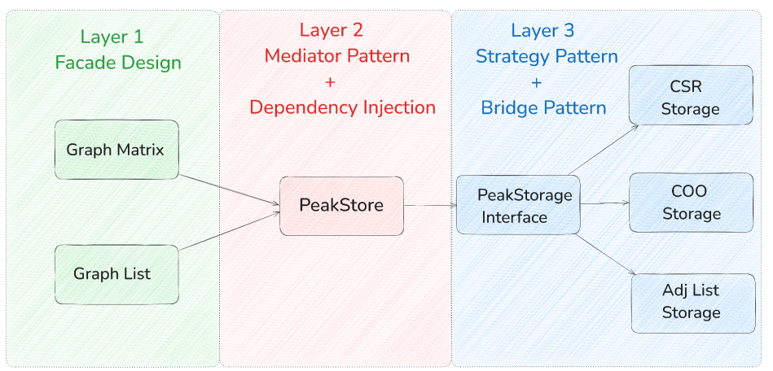
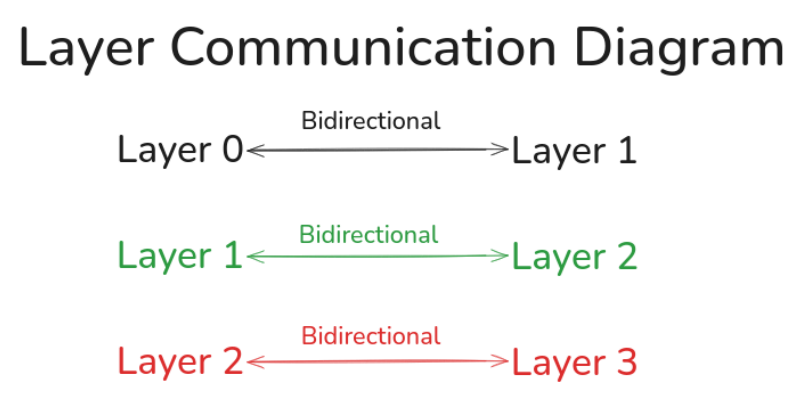
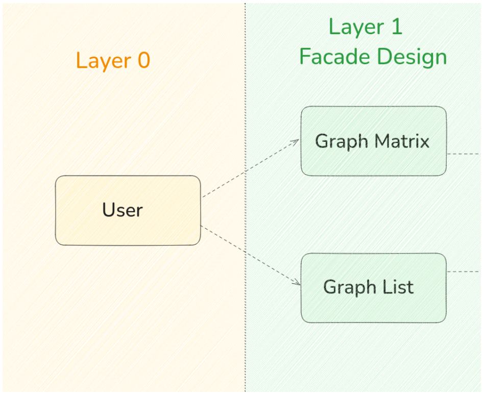
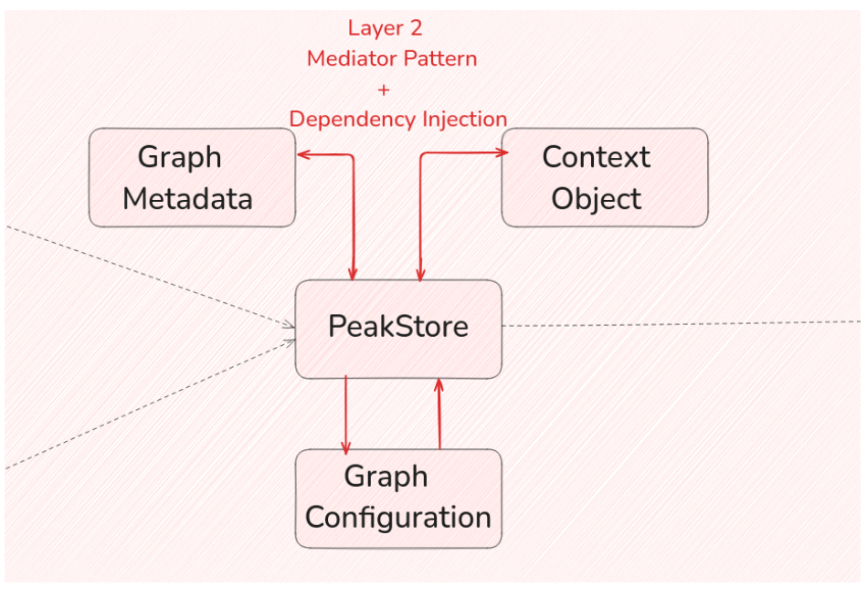
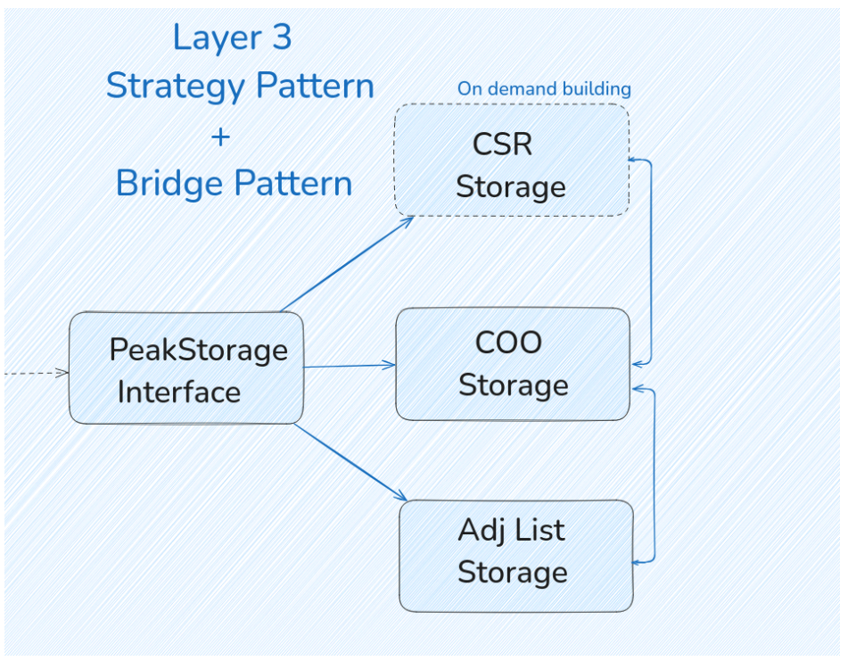
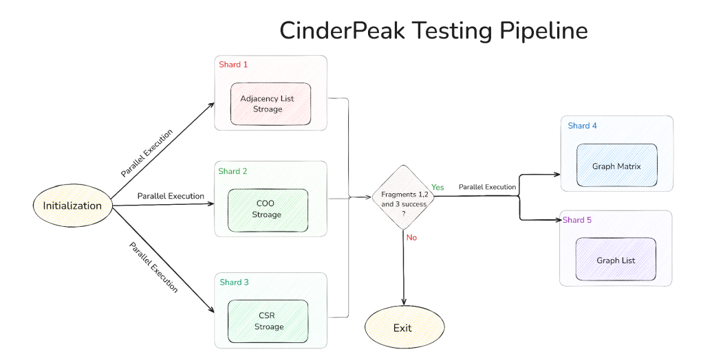

# CinderPeak Architecture Documentation

## 1. High Level Design

CinderPeak follows the Separation of Concerns design principle and a layered architecture. This applies to both the user-facing API and the storage engine (PeakStore). The communication model is structured into three distinct layers, each with well-defined responsibilities, data flow, and synchronized operations.

Each layer follows a set of design patterns as shown in the diagram below:

*
Fig 1.1: Design Pattern of each layer
*

### Layer Communication Flow

Each layer can follow a unidirectional or bidirectional communication pattern:

*
Fig 1.1: Bidirectional layer communication flow
*

Flow of data is sequentially from left to right, or right to left layer-by-layer, e.g., Layer 1 cannot directly communicate with layer 3.

**Note**: Layer 0 (not shown) is the user side code or the code accessing layer 1 from the user's end.

### 1.1 Layer 1

Layer 1 serves as the entry point for users interacting with the library. It communicates directly with Layer 0 and vice versa, which represents the user-facing code. This layer exposes the core API that users interact with such as creating graphs, adding vertices or edges, and performing graph operations. It acts as a bridge between the user and the internal storage or processing layers, ensuring a clean and intuitive interface while abstracting away low-level implementation details.

*
Fig 1.2: Layer 1 facade implementation
*

Layer 1 follows the Facade design pattern by encapsulating internal logic and delegating responsibilities to deeper layers (Layer 2 and 3) in the context of CinderPeak. This layer exposes a clean and intuitive API for users, abstracting the complexity of underlying storage engines, data structures, and graph operations.

### 1.2 Layer 2

This layer is one of the most critical components in the architectural design of CinderPeak, as it implements the internal storage engine known as PeakStore.

The PeakStore acts as the orchestrator for all underlying storage formats present in Layer 3. It is responsible for managing the instantiation, lifecycle, and communication between these storage engines.

*
Fig 1.2: Layer 2 internal storage
*

Layer 2 adheres to two prominent design patterns:
1. The Mediator Pattern
2. Dependency Injection

Dependency injection is achieved through a shared context object, which is passed to all the storage engines. This concept ensures that each storage format can access shared configurations and interact with other components when necessary.

The context object is created and owned by Layer 2 and carries vital metadata, including:
- Storage flags
- Active storage information
- Graph configuration options
- The graph's metadata, which defines its fundamental properties

Acting as a mediator, Layer 2 simplifies the interaction between Layer 1 and Layer 3 by abstracting away the complexities of underlying implementations.

### 1.3 Layer 3

Layer 3 is responsible for implementing the three core storage backends in CinderPeak and provides a unified interface through which PeakStore (Layer 2) interacts with the actual graph data. This layer encapsulates the specific logic and data structures for each storage format.

To ensure consistency and flexibility, all storage classes in Layer 3 inherit from a common abstract base class called StorageInterface. This interface defines the essential methods required for graph manipulation and querying, and each storage class provides its own concrete implementation by overriding these virtual methods.

*
Fig 1.3: Storage implementations with Strategy+Bridge patterns
*

Layer 3 is designed using a combination of the Strategy Pattern and the Bridge Pattern. The Strategy Pattern enables PeakStore to dynamically select the appropriate storage engine at runtime based on the graph's characteristics or depending on implementation chosen by the user. This allows the system to adapt its internal representation to optimize for performance and memory efficiency.

The Bridge Pattern helps decouple the abstraction (PeakStore and the context) from the implementation (the actual storage backends), making it easier to extend the library with new storage formats in the future without modifying the higher layers.

## 6. Testing

We will use Google Test (GTest) as the core testing framework, writing structured unit and integration tests for each component and storage format.

The full testing pipeline is designed to be modular, and is divided into five independent Pipeline shards, each targeting specific internal representations and graph structures and storage format within CinderPeak.

The pipeline can be executed both locally and via CI/CD automation (e.g., GitLab CI or GitHub Actions), supporting automation and consuming less computing power.

Pipeline Shards:
- Pipeline Shard 1: Tests Adjacency List
- Pipeline Shard 2: Tests CSR (Compressed Sparse Row)
- Pipeline Shard 3: Tests COO (Coordinate List)
- Pipeline Shard 4: Tests Graph Matrix
- Pipeline Shard 5: Tests Graph List

Shards 1,2 and 3 can be run in parallel for faster execution but shards 4,5 will only be executed if shards 1,2 and 3 passed.

*
Fig 6.1: Parallel test execution workflow
*

All five pipeline shards will be orchestrated and managed by a unified testing orchestrator called CinderFlow.
