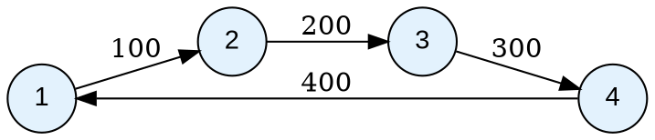

# CinderPeak — Example Files Documentation

This document provides detailed walkthroughs for every example file in the `examples/` directory. Each example is explained step-by-step, including what it demonstrates, how the code works internally, and the expected output.

---

## Table of Contents

| Example File | What It Covers |
|:-------------|:--------------|
| [PrimitiveGraph.cpp](#1-primitivegraphcpp) | Basic undirected weighted graph operations |
| [ListExample1.cpp](#2-listexample1cpp) | Weighted, unweighted, and custom-type graphs |
| [addVertex_usage.cpp](#3-addvertex_usagecpp) | `addVertex` API and duplicate handling |
| [addEdge_usage.cpp](#4-addedge_usagecpp) | Weighted and unweighted `addEdge` |
| [removeVertex_usage.cpp](#5-removevertex_usagecpp) | Removing vertices and cascading edge removal |
| [removeEdge_usage.cpp](#6-removeedge_usagecpp) | Removing individual edges |
| [updateEdge_usage.cpp](#7-updateedge_usagecpp) | Modifying edge weights |
| [getEdge_usage.cpp](#8-getedge_usagecpp) | Retrieving edge weights safely |
| [getNeighbors_usage.cpp](#9-getneighbors_usagecpp) | Querying adjacency lists |
| [hasVertex_usage.cpp](#10-hasvertex_usagecpp) | Checking vertex existence |
| [numVertices_usage.cpp](#11-numvertices_usagecpp) | Counting vertices |
| [numEdges_usage.cpp](#12-numedges_usagecpp) | Counting edges |
| [clearEdges_usage.cpp](#13-clearedges_usagecpp) | Removing all edges |
| [operator_access_usage.cpp](#14-operator_access_usagecpp) | Matrix-style `[]` operator |
| [toDot_usage.cpp](#15-todot_usagecpp) | Graphviz DOT export and BFS |

---

## 1. PrimitiveGraph.cpp

**Location:** `examples/CinderGraph/PrimitiveGraph.cpp`

### What it demonstrates
A complete undirected, weighted graph with 8 integer vertices arranged in a cycle, plus two cross-edges. Shows the return value pattern for `addEdge` and safe edge retrieval with `getEdge`.

### Code walkthrough

```cpp
GraphCreationOptions opts({GraphCreationOptions::Undirected});
CinderGraph<int, int> graph(opts);
```
Creates an **undirected** weighted graph. Because it is undirected, every call to `addEdge(A, B, w)` internally adds both `A→B` and `B→A`.

```cpp
for (int i = 1; i <= 8; ++i) {
    auto vResult = graph.addVertex(i);
    cout << "Adding vertex " << i
         << (vResult.second ? " succeeded\n" : " failed\n");
}
```
Adds 8 vertices. `addVertex` returns `pair<VertexType, bool>` — the second element is `true` on success.

```cpp
auto e1 = graph.addEdge(1, 2, 50);
graph.addEdge(2, 3, 60);
// ... more edges ...
auto e8 = graph.addEdge(8, 1, 120);
```
Builds a ring/cycle: `1—2—3—4—5—6—7—8—1`. Since the graph is undirected, each edge is stored in both directions.

```cpp
auto e9 = graph.addEdge(1, 5, 150);
auto e10 = graph.addEdge(6, 2, 850);
```
Adds two "cross-edges" that create shortcuts across the ring.

```cpp
auto getRes = graph.getEdge(2, 5);
if (getRes.has_value()) {
    cout << "Edge (2->5) value: " << *getRes << "\n";
} else {
    cout << "Edge (2->5) not found.\n";
}
```
`getEdge` returns `optional<EdgeType>`. Since there is no direct edge between 2 and 5 in the graph (only 1—5 exists), `has_value()` returns `false`.

### Expected output
```
Adding vertex 1 succeeded
Adding vertex 2 succeeded
...
Adding vertex 8 succeeded
Edge add (1->2) status: 1
Edge add (8->1) status: 1
Edge add (1->5) status: 1
Edge add (6->2) status: 1
Edge (2->5) not found.
```

---

## 2. ListExample1.cpp

**Location:** `examples/CinderGraph/ListExample1.cpp`

### What it demonstrates
Three different graph configurations in one file: (1) directed weighted `int` graph, (2) directed unweighted graph, (3) directed weighted graph with **custom types** (`ListVertex`, `ListEdge`). Also shows structured binding with `auto [key, status]`.

### Code walkthrough

**Graph 1 — Directed Weighted (int)**
```cpp
GraphCreationOptions opts({GraphCreationOptions::Directed});
CinderGraph<int, int> graph(opts);

graph.addVertex(1); graph.addVertex(2); graph.addVertex(3);
graph.addVertex(4); graph.addVertex(5);
graph.addEdge(1, 3, 5);
graph.updateEdge(1, 3, 10);  // changes weight from 5 to 10
```
Builds a directed graph and immediately updates one edge's weight.

**Using structured bindings with `addEdge`:**
```cpp
auto [weKey, edgeInserted] = graph.addEdge(1, 3, 5);
if (edgeInserted) {
    auto [src, dst, w] = weKey;
    cout << "Added edge " << src << "->" << dst << " weight=" << w << "\n";
}
```
`addEdge` on a weighted graph returns `pair<tuple<V,V,E>, bool>`. C++17 structured bindings unpack both the tuple and its contents in one step.

**Graph 2 — Unweighted**
```cpp
CinderGraph<int, Unweighted> unweighted_graph(opts);
auto [ueKey, uadded] = unweighted_graph.addEdge(1, 2);
```
`Unweighted` is a zero-size sentinel type. The `addEdge` overload for unweighted graphs returns `pair<pair<V,V>, bool>` instead of the weighted variant.

**Graph 3 — Custom Types**
```cpp
class ListVertex : public CinderVertex {
public:
    int data;
    ListVertex(int value) : data{value} {}
    ListVertex() = default;
};

class ListEdge : public CinderEdge {
public:
    float edge_weight;
    ListEdge(float weight) : edge_weight{weight} {}
    ListEdge() = default;
};
```
Both inherit from `CinderVertex`/`CinderEdge` — required for the internal `__id_` hashing mechanism.

```cpp
CinderGraph<ListVertex, ListEdge> listGraph(options);
listGraph.addVertex(lv1);
listGraph.addVertex(lv2);
auto [listWeKey, listAdded] = listGraph.addEdge(lv1, lv2, e1);
```

```cpp
// Update the edge — note: updateEdge returns the NEW weight, not the previous one
auto [retWeight, listUpdated] = listGraph.updateEdge(lv1, lv2, e2);
if (listUpdated)
    cout << "Updated weight: " << retWeight.edge_weight << "\n"; // 0.8
```

---

## 3. addVertex_usage.cpp

**Location:** `examples/CinderGraph/addVertex_usage.cpp`

### What it demonstrates
All behaviors of `addVertex`: success, duplicate detection, and use with multiple vertex types.

### Key patterns

**Basic usage:**
```cpp
CinderGraph<int, int> g;
auto [v, ok] = g.addVertex(10);
// ok == true, v == 10
```

**Duplicate detection:**
```cpp
g.addVertex(10);
auto [v2, ok2] = g.addVertex(10);  // same vertex again
// ok2 == false — vertex already exists
// No crash — failure is silent unless exceptions are enabled
```

**String vertices:**
```cpp
CinderGraph<string, int> sg;
sg.addVertex("Alice");
sg.addVertex("Bob");
```

**Key insight:** `addVertex` does NOT add any edges. Edges must be added separately with `addEdge`. Adding a vertex that already exists is a no-op — the library logs a warning internally.

---

## 4. addEdge_usage.cpp

**Location:** `examples/CinderGraph/addEdge_usage.cpp`

### What it demonstrates
Both overloads of `addEdge`: unweighted (for `Unweighted` EdgeType) and weighted (for numeric/custom EdgeTypes). Also shows failure handling when vertices don't exist.

### Unweighted graph
```cpp
CinderGraph<int, Unweighted> g1({GraphCreationOptions::getDefaultCreateOptions()});
g1.addVertex(1); g1.addVertex(2); g1.addVertex(3);

auto [edge1, added1] = g1.addEdge(1, 2);
// added1 == true
auto [edge2, added2] = g1.addEdge(2, 3);
// edge2 is pair<int,int> == {2, 3}
cout << "Total edges: " << g1.numEdges() << "\n"; // 2
```

### Weighted graph
```cpp
CinderGraph<int, double> g2;
g2.addVertex(10); g2.addVertex(20);
auto [edge3, added3] = g2.addEdge(10, 20, 5.5);
// added3 == true
```

### Error case — missing vertices
```cpp
CinderGraph<int, Unweighted> g4;
// Note: vertices 100 and 200 were never added!
auto [edge5, added5] = g4.addEdge(100, 200);
// added5 == false — PeakStatus::VertexNotFound returned internally
cout << (added5 ? "success" : "failed") << "\n"; // failed
```

This demonstrates that edges require **both vertices to exist** before they can be added.

### String vertices with float weights
```cpp
CinderGraph<string, float> g5;
g5.addVertex("New York"); g5.addVertex("Los Angeles");
g5.addEdge("New York", "Los Angeles", 2451.0f);
```
Any primitive type or `string` works as vertex and edge type.

---

## 5. removeVertex_usage.cpp

**Location:** `examples/CinderGraph/removeVertex_usage.cpp`

### What it demonstrates
Removing a vertex cascades to remove **all edges connected to it** — both outgoing and incoming.

### Cascading removal
```cpp
CinderGraph<int, Unweighted> g;
g.addVertex(1); g.addVertex(2); g.addVertex(3); g.addVertex(4);
g.addEdge(1, 2); g.addEdge(2, 3); g.addEdge(3, 4); g.addEdge(1, 4);

cout << g.numVertices() << "\n"; // 4
cout << g.numEdges() << "\n";    // 4

bool removed = g.removeVertex(2);
// Removes vertex 2 AND physically removes edges (1,2) and (2,3) from storage

cout << g.numVertices() << "\n"; // 3
```

> **Caveat:** `removeVertex` physically removes edges from the adjacency list but does **not** update the edge count metadata. `numEdges()` may still show `4` after this call. If you need accurate edge counts, use `removeEdge()` first.

### Non-existent vertex
```cpp
bool removed2 = g.removeVertex(99);
cout << (removed2 ? "success" : "failed") << "\n"; // failed
```

### Why cascading removal matters
Without cascading, removing a vertex would leave "dangling edges" pointing to a non-existent vertex. The AdjacencyList backend handles this by:
1. Erasing the vertex's own adjacency list entry (`_adj.erase(id)`)
2. Scanning all other vertices' neighbor lists and removing entries pointing to the deleted vertex ID

---

## 6. removeEdge_usage.cpp

**Location:** `examples/CinderGraph/removeEdge_usage.cpp`

### What it demonstrates
Removing individual edges while keeping the vertices. Returns the old edge weight.

### Key pattern
```cpp
CinderGraph<int, int> g;
g.addVertex(1); g.addVertex(2);
g.addEdge(1, 2, 42);

auto [prevWeight, ok] = g.removeEdge(1, 2);
// ok == true
// prevWeight == optional<int>{42}

cout << "Removed edge had weight: " << *prevWeight << "\n"; // 42
cout << g.numEdges() << "\n";    // 0
cout << g.numVertices() << "\n"; // 2  (vertices remain!)
```

### Undirected graphs
For undirected graphs, removing edge `(A, B)` also removes the reverse edge `(B, A)` automatically — the library handles this in `PeakStore::removeEdge`.

---

## 7. updateEdge_usage.cpp

**Location:** `examples/CinderGraph/updateEdge_usage.cpp`

### What it demonstrates
Changing the weight of an existing edge. Only available for weighted graphs.

### Key pattern
```cpp
CinderGraph<int, int> g;
g.addVertex(1); g.addVertex(2);
g.addEdge(1, 2, 10);

auto [weight, updated] = g.updateEdge(1, 2, 99);
// weight == 99   (always the newWeight you passed in)
// updated == true

auto edge = g.getEdge(1, 2);
cout << *edge << "\n"; // 99  (new value confirmed)
```

> **Note:** `updateEdge` always returns the `newWeight` parameter — not the previous weight. The library does not currently expose the old weight on update.

### Failure case
```cpp
auto [pv, updated2] = g.updateEdge(1, 99, 50); // vertex 99 doesn't exist
// updated2 == false
```

### Internal flow
`updateEdge` calls `AdjacencyList::impl_updateEdge` which iterates the neighbor list of `src` and updates the matching `(destId, weight)` pair in-place. For undirected graphs, `PeakStore` also calls `impl_updateEdge(dest, src, newWeight)` to update the reverse edge.

---

## 8. getEdge_usage.cpp

**Location:** `examples/CinderGraph/getEdge_usage.cpp`

### What it demonstrates
Safe edge retrieval using `std::optional`. Never crashes on missing edges.

### Key pattern
```cpp
CinderGraph<int, int> g;
g.addVertex(1); g.addVertex(2);
g.addEdge(1, 2, 55);

auto edge = g.getEdge(1, 2);
if (edge.has_value())
    cout << "Weight: " << *edge << "\n"; // 55

auto missing = g.getEdge(9, 9);
cout << missing.has_value() << "\n"; // 0 (false)
```

The `optional<EdgeType>` return type means you always must check `.has_value()` before dereferencing — this enforces safe access at compile time.

---

## 9. getNeighbors_usage.cpp

**Location:** `examples/CinderGraph/getNeighbors_usage.cpp`

### What it demonstrates
Querying all neighbors of a vertex. Works for directed, undirected, and string-vertex graphs.

### Directed graph
```cpp
CinderGraph<int, int> g;
g.addVertex(1); g.addVertex(2); g.addVertex(3); g.addVertex(4);
g.addEdge(1, 2, 10);
g.addEdge(1, 3, 20);
g.addEdge(1, 4, 30);

auto neighbors = g.getNeighbors(1);
// neighbors == [(2, 10), (3, 20), (4, 30)]

for (auto& [vertex, weight] : neighbors) {
    cout << "1 -> " << vertex << " (weight: " << weight << ")\n";
}
```

### Vertex with no outgoing edges
```cpp
auto neighbors2 = g.getNeighbors(4);
if (neighbors2.empty())
    cout << "Vertex 4 has no outgoing edges\n"; // prints this
```

### Undirected graph — both directions visible
```cpp
GraphCreationOptions undirectedOpts({GraphCreationOptions::Undirected});
CinderGraph<int, double> g2(undirectedOpts);
g2.addVertex(1); g2.addVertex(2); g2.addVertex(3);
g2.addEdge(1, 2, 1.5);
g2.addEdge(2, 3, 2.5);

auto n = g2.getNeighbors(2);
// Returns [(1, 1.5), (3, 2.5)] — vertex 2 sees both its neighbors
```

### Non-existent vertex
```cpp
auto neighbors3 = g.getNeighbors(99);
// Returns empty vector — no crash
```

### Internal implementation note
`getNeighbors` reads from `AdjacencyList._adj[vertexId]`, then translates internal `VertexId` values back to user `VertexType` values using `_vertex_data`. The data is copied **outside the lock** for efficiency.

---

## 10. hasVertex_usage.cpp

**Location:** `examples/CinderGraph/hasVertex_usage.cpp`

### What it demonstrates
Checking whether a vertex exists. O(1) average complexity.

```cpp
CinderGraph<int, int> g;
g.addVertex(1); g.addVertex(2); g.addVertex(3);

cout << g.hasVertex(1) << "\n";  // 1 (true)
cout << g.hasVertex(99) << "\n"; // 0 (false)

g.removeVertex(2);
cout << g.hasVertex(2) << "\n";  // 0 (false — removed)
```

---

## 11. numVertices_usage.cpp

**Location:** `examples/CinderGraph/numVertices_usage.cpp`

### What it demonstrates
Tracking the vertex count, which updates after `addVertex`, `removeVertex`, and `clearVertices`.

```cpp
CinderGraph<int, int> g;
cout << g.numVertices() << "\n"; // 0

g.addVertex(1); g.addVertex(2); g.addVertex(3);
cout << g.numVertices() << "\n"; // 3

g.removeVertex(2);
cout << g.numVertices() << "\n"; // 2

g.clearVertices();
cout << g.numVertices() << "\n"; // 0
```

Internally, the count is maintained in `GraphInternalMetadata::num_vertices` and updated atomically via `updateVertexCount(UpdateOp::Add/Remove/Clear)`.

---

## 12. numEdges_usage.cpp

**Location:** `examples/CinderGraph/numEdges_usage.cpp`

### What it demonstrates
Tracking the edge count. Counts update after `addEdge`, `removeEdge`, `removeVertex`, and `clearEdges`.

```cpp
CinderGraph<int, int> g;
g.addVertex(1); g.addVertex(2); g.addVertex(3);
g.addEdge(1, 2, 10);
g.addEdge(2, 3, 20);
g.addEdge(1, 3, 30);

cout << g.numEdges() << "\n"; // 3

g.removeEdge(1, 2);
cout << g.numEdges() << "\n"; // 2

g.clearEdges();
cout << g.numEdges() << "\n"; // 0
```

> **Note for undirected graphs:** Each `addEdge` call on an undirected graph stores two internal directed edges (A→B and B→A). `numEdges()` counts **both directions** — so a single `addEdge` call increments the count by **2**, since `GraphEvents::onEdgeAdded` fires once for each direction.

---

## 13. clearEdges_usage.cpp

**Location:** `examples/CinderGraph/clearEdges_usage.cpp`

### What it demonstrates
Bulk-removing all edges while keeping vertices. Useful for resetting graph connectivity without rebuilding the vertex set.

```cpp
CinderGraph<int, int> g;
g.addVertex(1); g.addVertex(2); g.addVertex(3);
g.addEdge(1, 2, 10);
g.addEdge(2, 3, 20);

cout << g.numVertices() << "\n"; // 3
cout << g.numEdges() << "\n";    // 2

g.clearEdges();

cout << g.numVertices() << "\n"; // 3  — vertices preserved
cout << g.numEdges() << "\n";    // 0  — edges removed
```

Internally, `AdjacencyList::impl_clearEdges()` iterates every vertex's neighbor list and calls `.clear()` on it, preserving the vertex entries in `_adj` but emptying their neighbor vectors.

---

## 14. operator_access_usage.cpp

**Location:** `examples/CinderGraph/operator_access_usage.cpp`

### What it demonstrates
The `[]` operator provides matrix-style syntax for reading and writing edge weights.

### Reading edge weight
```cpp
CinderGraph<int, int> g;
g.addVertex(1); g.addVertex(2);
g.addEdge(1, 2, 42);

int weight = g[1][2];  // returns 42
```
Internally `g[1]` returns a `CinderGraphRowProxy` object. Calling `[2]` on the proxy calls `getEdge(1, 2)`. If the edge doesn't exist, it **throws** `std::runtime_error`.

### Writing edge weight via proxy
```cpp
g[1](2, 99);  // equivalent to addEdge(1, 2, 99)
```
The `operator()` overload on `CinderGraphRowProxy` calls `addEdge(src, dest, weight)`.

### When to use `[]` vs `getEdge`
| Method | Behavior on missing edge |
|:-------|:------------------------|
| `g[src][dest]` | Throws `std::runtime_error` |
| `g.getEdge(src, dest)` | Returns `std::nullopt` (safe) |

Use `getEdge` when you aren't certain the edge exists. Use `[]` only when you know it must exist.

---

## 15. toDot_usage.cpp

**Location:** `examples/CinderGraph/toDot_usage.cpp`

### What it demonstrates
Exporting graphs to Graphviz DOT format for visualization. Also shows BFS usage and multiple graph configurations.

### Basic DOT export
```cpp
GraphCreationOptions directedOpts({GraphCreationOptions::Directed});
CinderGraph<int, int> g1(directedOpts);

for (int v : {1, 2, 3, 4}) g1.addVertex(v);
g1.addEdge(1, 2, 100);
g1.addEdge(2, 3, 200);
g1.addEdge(3, 4, 300);
g1.addEdge(4, 1, 400); // creates a cycle

g1.toDot("g1_directed.dot");
```

The generated `g1_directed.dot` file:


**Render with Graphviz:**
```bash
dot -Tpng g1_directed.dot -o g1_directed.png
```

### Undirected graph export
```cpp
CinderGraph<int, int> g4;  // uses default (directed) but...
g4.addVertex(1); g4.addVertex(2); g4.addVertex(3);
g4.addEdge(1, 2, 100);
g4.toDot("g4_undirected.dot");
```
For undirected graphs, `impl_toDot` uses `"--"` instead of `"->"` as the edge connector.

### Isolated nodes
```cpp
CinderGraph<int, int> g2(directedOpts);
g2.addVertex(10); g2.addVertex(20); g2.addVertex(30); // 30 has no edges
g2.addEdge(10, 20, 210);
g2.toDot("g2_isolated.dot");
```
Isolated nodes (no edges) still appear in the DOT output because `impl_toDot` declares all nodes first before drawing edges.

### BFS traversal (current stub)
```cpp
auto bfsResult = g1.bfs(1);
if (bfsResult.isOK()) {
    for (const auto& v : bfsResult.order_) {
        cout << v << "->";
    }
    cout << "END\n";
}
```
> **Note:** The BFS implementation is currently a stub that returns hardcoded placeholder data (`[1, 2, 3, 4]`). See the Architecture docs for context. Real BFS traversal is planned once the storage synchronization design is finalized.

### Restrictions on `toDot`
`toDot` is only available when:
- `VertexType` is primitive (`int`, `float`, `double`, `string`, etc.)
- `EdgeType` is primitive **or** `Unweighted`

For custom types, the method is disabled at compile time via `std::enable_if`.

---

## Building and Running Examples

After building with CMake:

```bash
mkdir build && cd build
cmake .. -DBUILD_EXAMPLES=ON
cmake --build .
```

Compiled example binaries are placed in `build/bin/examples/`.

```bash
# Run the primitive graph example
./build/bin/examples/PrimitiveGraph

# Run the addEdge example
./build/bin/examples/addEdge_usage

# Run the toDot example (generates .dot files)
./build/bin/examples/toDot_usage
dot -Tpng g1_directed.dot -o g1_directed.png
```
