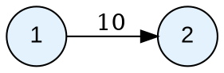

# CinderPeak — Usage Guide

This guide covers the complete public API of CinderPeak with practical, step-by-step examples. It is written for both beginners and experienced C++ developers.

---

## Quick Links
- [Installation](installation.md)
- [Architecture](architecture.md)
- [Example Files](examples/)

---

## 1. Including the Library

Always include the single convenience header:

```cpp
#include "CinderPeak.hpp"
using namespace CinderPeak;
```

This pulls in `CinderGraph`, `GraphCreationOptions`, `Unweighted`, `CinderVertex`, `CinderEdge`, and all supporting types.

---

## 2. GraphCreationOptions

Every graph is configured with `GraphCreationOptions` at construction time.

```cpp
// Directed graph (default when no options given)
GraphCreationOptions opts({GraphCreationOptions::Directed});

// Undirected graph
GraphCreationOptions opts({GraphCreationOptions::Undirected});

```

| Option | Description |
|:-------|:------------|
| `Directed` | Edges have direction: A→B ≠ B→A |
| `Undirected` | Edges are bidirectional: A—B adds both A→B and B→A |

> **Default** (no options): `{Directed}`

---

## 3. Creating a Graph

`CinderGraph<VertexType, EdgeType>` is the main class.

- `VertexType` — the type stored at each vertex (e.g., `int`, `string`, custom class)
- `EdgeType` — the type stored on each edge (e.g., `int`, `double`), or `Unweighted` for no weight

```cpp
// Directed weighted graph: integer vertices, integer edge weights
CinderGraph<int, int> g;

// Undirected weighted graph: string vertices, float weights
GraphCreationOptions opts({GraphCreationOptions::Undirected});
CinderGraph<string, float> cityGraph(opts);

// Directed unweighted graph
CinderGraph<int, Unweighted> unweightedGraph;
```

---

## 4. Core API Reference

### 4.1 `addVertex(v)` — Add a Vertex

Inserts a vertex into the graph.

**Signature:**
```cpp
pair<VertexType, bool> addVertex(const VertexType& v);
```

**Returns:** `{vertex, true}` on success, `{vertex, false}` if already exists.

```cpp
CinderGraph<int, int> g;

auto [v, ok] = g.addVertex(1);
if (ok) cout << "Added vertex " << v << "\n";  // Added vertex 1

g.addVertex(2);
g.addVertex(3);

cout << g.numVertices() << "\n";  // 3
```

---

### 4.2 `addEdge(src, dest)` — Add an Unweighted Edge

Only available for `CinderGraph<V, Unweighted>`.

**Signature:**
```cpp
pair<pair<V,V>, bool> addEdge(const V& src, const V& dest);
```

**Returns:** `{{src, dest}, true}` on success, `{{src, dest}, false}` if already exists.

```cpp
CinderGraph<int, Unweighted> g;
g.addVertex(1);
g.addVertex(2);

auto [edgeKey, added] = g.addEdge(1, 2);
if (added) {
    auto [s, d] = edgeKey;
    cout << "Added edge " << s << "->" << d << "\n";
}
```

---

### 4.3 `addEdge(src, dest, weight)` — Add a Weighted Edge

Only available for weighted graphs (EdgeType ≠ `Unweighted`).

**Signature:**
```cpp
pair<tuple<V,V,E>, bool> addEdge(const V& src, const V& dest, const E& weight);
```

**Returns:** `{{src, dest, weight}, true}` on success, `{{src, dest, weight}, false}` if already exists.

```cpp
CinderGraph<int, double> g;
g.addVertex(10);
g.addVertex(20);

auto [edgeKey, added] = g.addEdge(10, 20, 5.5);
if (added) {
    auto [src, dst, w] = edgeKey;
    cout << src << "->" << dst << " weight=" << w << "\n";
    // 10->20 weight=5.5
}
```

> **Note:** Both source and destination vertices must exist before calling `addEdge`. Adding an edge to non-existent vertices will fail gracefully (returns `false`).

---

### 4.4 `removeVertex(v)` — Remove a Vertex

Removes a vertex **and all its associated edges** from the graph.

**Signature:**
```cpp
bool removeVertex(const VertexType& v);
```

**Returns:** `true` on success, `false` if not found.

```cpp
CinderGraph<int, int> g;
g.addVertex(1); g.addVertex(2); g.addVertex(3);
g.addEdge(1, 2, 10);
g.addEdge(1, 3, 20);

bool removed = g.removeVertex(1);
cout << removed << "\n";          // 1 (true)
cout << g.numVertices() << "\n";  // 2
```


---

### 4.5 `removeEdge(src, dest)` — Remove an Edge

Removes the edge between two vertices, preserving both vertices.

**Signature:**
```cpp
pair<optional<EdgeType>, bool> removeEdge(const V& src, const V& dest);
```

**Returns:** `{weight, true}` on success, `{nullopt, false}` if not found.

```cpp
CinderGraph<int, int> g;
g.addVertex(1); g.addVertex(2);
g.addEdge(1, 2, 42);

auto [prevWeight, ok] = g.removeEdge(1, 2);
if (ok && prevWeight.has_value())
    cout << "Removed edge, had weight: " << *prevWeight << "\n"; // 42

cout << g.numEdges() << "\n"; // 0
```

---

### 4.6 `updateEdge(src, dest, newWeight)` — Update Edge Weight

Updates an existing edge's weight. Only available for weighted graphs.

**Signature:**
```cpp
pair<EdgeType, bool> updateEdge(const V& src, const V& dest, const E& newWeight);
```

**Returns:** `{newWeight, true}` on success, `{newWeight, false}` on failure.

> **Note:** The returned EdgeType is always the `newWeight` passed in — the library does not currently return the previous weight.

```cpp
CinderGraph<int, int> g;
g.addVertex(1); g.addVertex(2);
g.addEdge(1, 2, 10);

auto [weight, updated] = g.updateEdge(1, 2, 99);
if (updated)
    cout << "Updated to: " << weight << "\n"; // Updated to: 99
```

---

### 4.7 `getEdge(src, dest)` — Retrieve an Edge

Returns the edge weight as `std::optional<EdgeType>`.

**Signature:**
```cpp
optional<EdgeType> getEdge(const V& src, const V& dest);
```

```cpp
CinderGraph<int, int> g;
g.addVertex(1); g.addVertex(2);
g.addEdge(1, 2, 55);

auto edge = g.getEdge(1, 2);
if (edge.has_value())
    cout << "Weight: " << *edge << "\n"; // 55

auto missing = g.getEdge(1, 99);
cout << missing.has_value() << "\n"; // 0 (false)
```

---

### 4.8 `hasVertex(v)` — Check Vertex Existence

```cpp
bool hasVertex(const VertexType& v);
```

```cpp
CinderGraph<int, int> g;
g.addVertex(5);

cout << g.hasVertex(5)  << "\n"; // 1 (true)
cout << g.hasVertex(99) << "\n"; // 0 (false)
```

---

### 4.9 `getNeighbors(v)` — Get All Neighbors

Returns all adjacent vertices and their edge weights.

**Signature:**
```cpp
vector<pair<VertexType, EdgeType>> getNeighbors(const VertexType& v);
```

**Complexity:** O(deg(v))

```cpp
CinderGraph<int, int> g;
g.addVertex(1); g.addVertex(2); g.addVertex(3);
g.addEdge(1, 2, 10);
g.addEdge(1, 3, 20);

auto neighbors = g.getNeighbors(1);
for (auto& [neighbor, weight] : neighbors) {
    cout << "1 -> " << neighbor << " (w=" << weight << ")\n";
}
// 1 -> 2 (w=10)
// 1 -> 3 (w=20)

// Non-existent vertex returns empty
auto empty = g.getNeighbors(99);
cout << empty.empty() << "\n"; // 1 (true)
```

---

### 4.10 `clearEdges()` — Remove All Edges

Removes all edges while keeping all vertices.

```cpp
CinderGraph<int, int> g;
g.addVertex(1); g.addVertex(2);
g.addEdge(1, 2, 10);

g.clearEdges();
cout << g.numVertices() << "\n"; // 2 (vertices preserved)
cout << g.numEdges() << "\n";    // 0
```

---

### 4.11 `clearVertices()` — Remove Everything

Removes all vertices and all edges.

```cpp
g.clearVertices();
cout << g.numVertices() << "\n"; // 0
cout << g.numEdges() << "\n";    // 0
```

---

### 4.12 `numVertices()` / `numEdges()` — Graph Size

```cpp
cout << g.numVertices() << "\n";
cout << g.numEdges() << "\n";
```

> **Note for undirected graphs:** Each `addEdge(A, B, w)` call on an undirected graph stores two internal directed edges (A→B and B→A). `numEdges()` counts **both directions**, so a single `addEdge` call increments the count by **2**.

---

### 4.13 `toDot(filename)` — Export to Graphviz DOT

Exports the graph to a `.dot` file for visualization.

Only available when VertexType and EdgeType are primitive (or `Unweighted`).

```cpp
CinderGraph<int, int> g;
g.addVertex(1); g.addVertex(2); g.addVertex(3);
g.addEdge(1, 2, 10);
g.addEdge(2, 3, 20);
g.addEdge(3, 1, 30); // cycle

g.toDot("graph.dot");
// Renders with: dot -Tpng graph.dot -o graph.png
```

Example `.dot` output for a directed graph:


---

### 4.14 `getGraphStatistics()` — Runtime Statistics

```cpp
cout << g.getGraphStatistics();
// === Graph Statistics ===
// Vertices: 3
// Edges: 2
// Density: 0.33
```

---

### 4.15 `setGraphName()` / `getGraphName()` — Graph Identity

Graph names must be alphanumeric and 1–32 characters long.

```cpp
bool ok = g.setGraphName("MyGraph");
cout << ok << "\n";                // 1
cout << g.getGraphName() << "\n"; // MyGraph
```

---

### 4.16 Operator `[]` — Matrix-style Access

```cpp
// Read edge weight (throws if edge missing)
int w = g[1][2];

// Write edge weight via proxy
g[1](2, 99); // sets weight of edge 1->2 to 99
```

---

## 5. Runtime Configuration

### Logging

```cpp
g.setConsoleLogging(true);           // enable console output (default: disabled)
g.setFileLogging("debug.log");       // write logs to file
g.unsetFileLogging();                // stop file logging
```

### Exception Handling

By default, errors are handled silently (return `false` / `nullopt`). You can enable exceptions:

```cpp
g.setThrowExceptions(true);
// Now errors throw std::runtime_error
```

---

## 6. Using Custom Types

For complex vertex/edge data, inherit from `CinderVertex` / `CinderEdge`.

```cpp
#include "CinderPeak.hpp"
using namespace CinderPeak;

// Custom vertex type representing a city
class City : public CinderVertex {
public:
    std::string name;
    int population;

    City() = default;
    City(const std::string& n, int pop) : name(n), population(pop) {}
};

// Custom edge type representing a road
class Road : public CinderEdge {
public:
    float distance_km;
    std::string highway;

    Road() = default;
    Road(float dist, const std::string& hw) : distance_km(dist), highway(hw) {}
};

int main() {
    GraphCreationOptions opts({GraphCreationOptions::Undirected});
    CinderGraph<City, Road> roadMap(opts);

    City delhi("Delhi", 30000000);
    City mumbai("Mumbai", 20000000);

    roadMap.addVertex(delhi);
    roadMap.addVertex(mumbai);

    Road nh48(1400.0f, "NH-48");
    roadMap.addEdge(delhi, mumbai, nh48);

    auto neighbors = roadMap.getNeighbors(delhi);
    for (auto& [city, road] : neighbors) {
        cout << "Delhi -> " << city.name
             << " via " << road.highway
             << " (" << road.distance_km << " km)\n";
    }
    return 0;
}
```

> **Important:** Custom vertex types need `CinderVertex` base class for the internal `__id_` hashing mechanism to work. Without it, you'll get a `static_assert` error.

---

## 7. Complete Example: Road Network

```cpp
#include "CinderPeak.hpp"
#include <iostream>
using namespace CinderPeak;
using namespace std;

int main() {
    // Undirected weighted graph: cities and distances
    GraphCreationOptions opts({GraphCreationOptions::Undirected});
    CinderGraph<string, float> india(opts);

    // Add cities
    india.addVertex("Delhi");
    india.addVertex("Mumbai");
    india.addVertex("Kolkata");
    india.addVertex("Chennai");

    // Add roads (distances in km)
    india.addEdge("Delhi", "Mumbai", 1400.0f);
    india.addEdge("Delhi", "Kolkata", 1500.0f);
    india.addEdge("Mumbai", "Chennai", 1340.0f);
    india.addEdge("Kolkata", "Chennai", 1660.0f);

    // Print all neighbors of Delhi
    cout << "Routes from Delhi:\n";
    for (auto& [city, dist] : india.getNeighbors("Delhi")) {
        cout << "  Delhi -> " << city << ": " << dist << " km\n";
    }

    // Check stats
    cout << "\nGraph has " << india.numVertices() << " cities and "
         << india.numEdges() << " routes.\n";

    // Export to DOT
    india.toDot("india_roads.dot");
    cout << "Exported to india_roads.dot\n";

    return 0;
}
```

Expected output:
```
Routes from Delhi:
  Delhi -> Mumbai: 1400 km
  Delhi -> Kolkata: 1500 km

Graph has 4 cities and 8 routes.
Exported to india_roads.dot
```

> **Note:** The edge count is `8` (not `4`) because this is an undirected graph — each `addEdge` call stores two directed edges internally, and `numEdges()` counts both directions.